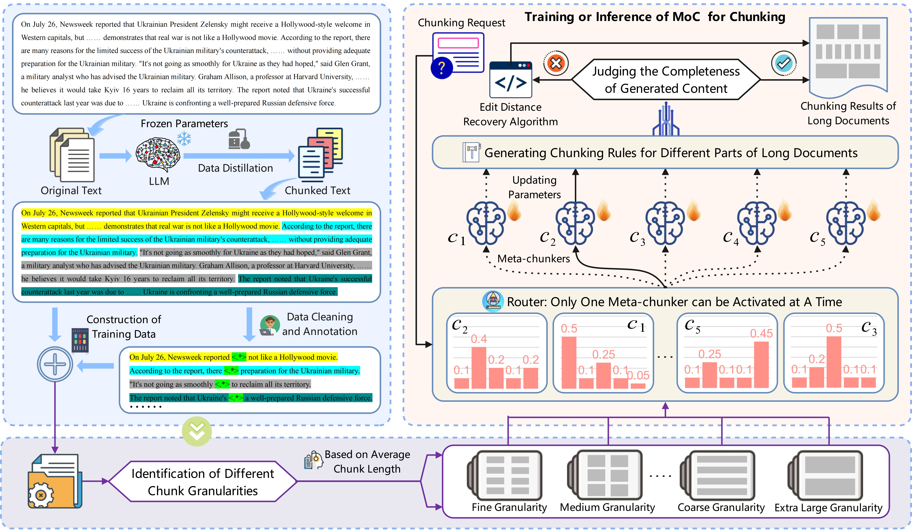

<h1 align="center">
    MoC: Mixtures of Text Chunking Learners for Retrieval-Augmented Generation System
</h1>
<p align="center">
    <a href="https://arxiv.org/abs/2503.09600">
        
    </a>
    <a href="https://huggingface.co/papers/2503.09600">
        
    </a>
    <a href="https://opensource.org/license/apache-2-0">
        
    </a>
    <br>
    <a href="https://huggingface.co/datasets/Robot2050/Meta-chunker">
        
    </a>
    <a href="https://huggingface.co/Robot2050/Meta-chunker-1.5B">
        
    </a>
    <a href="https://huggingface.co/Robot2050/Meta-chunker-1.5B-60K">
        
    </a>
    <a href="https://huggingface.co/Robot2050/MoC">
        
    </a>
</p>

## 🧠 Inspiration
1️⃣ We break through the traditional indirect evaluation paradigm, propose dual indicators of Boundary Clarity and Chunk Stickiness, and achieve direct quantification of chunk quality. Furthermore, by deconstructing the mechanism of semantic chunking failure, we provide experimental validation for LLM's involvement in chunking tasks.

2️⃣ We design a hybrid chunking expert architecture called MoC, which dynamically schedules lightweight chunking experts through a multi-granularity perception routing network. This architecture innovatively integrates a regular expression-guided chunking method, a multi-granularity chunking mechanism based on sparse activation, and an edit distance-driven correction algorithm.

3️⃣ To verify the effectiveness of our proposed metrics and chunking methods, we conduct multi-dimensional experiments on four question answering datasets utilizing five different language models, and perform an in-depth analysis.

**Chinese Version:**

1️⃣ 突破传统间接评价范式，提出 Boundary Clarity 与 Chunk Stickiness 双指标，实现分块质量的直接量化。并且通过解构语义分块失效机理，为LLM介入分块任务提供了实验验证。

2️⃣ 设计混合分块专家架构 MoC，通过多粒度感知路由网络动态调度轻量化分块专家。该架构创新性融合：正则表达式引导的分块方法，基于稀疏激活的多粒度分块机制和编辑距离驱动的校正算法。

3️⃣ 为了验证我们所提出指标和分块方法的有效性，我们共采用了五个不同的语言模型，在四个问答数据集上进行了多维度的实验，并进行了深入的分析。

## 📜 Quick Start

**Evaluation Metrics:**

- *our _metrics/chunk_eval.py* is used to evaluate the clarity of chunk boundaries.
- *our _metrics/relation_eval.py*  is used to evaluate the stickiness of text chunks in the complete or incomplete graphs constructed after chunking. 
- *chunk_gpt.py* is utilized to prepare the dataset for training the chunking model. 
- *chunk_sft_list_z.py* employs a meta-chunker to perform the chunking process.
- *chunk_MoC.py* constructs a MoC architecture to implement chunking. 

📌 Currently, we are preparing more [text chunking datasets](https://huggingface.co/datasets/Robot2050/Meta-chunker) to fill the data gap in this field. Our data sources include not only the internet but also domain-specific data and arXiv paper data.



## Citation

```
@article{MoC,
  title={MoC: Mixtures of Text Chunking Learners for Retrieval-Augmented Generation System},
  author={Zhao, Jihao and Ji, Zhiyuan and Fan, Zhaoxin and Wang, Hanyu and Niu, Simin and Tang, Bo and Xiong, Feiyu and Li, Zhiyu},
  journal={arXiv preprint arXiv:2503.09600},
  year={2025}
}
```
